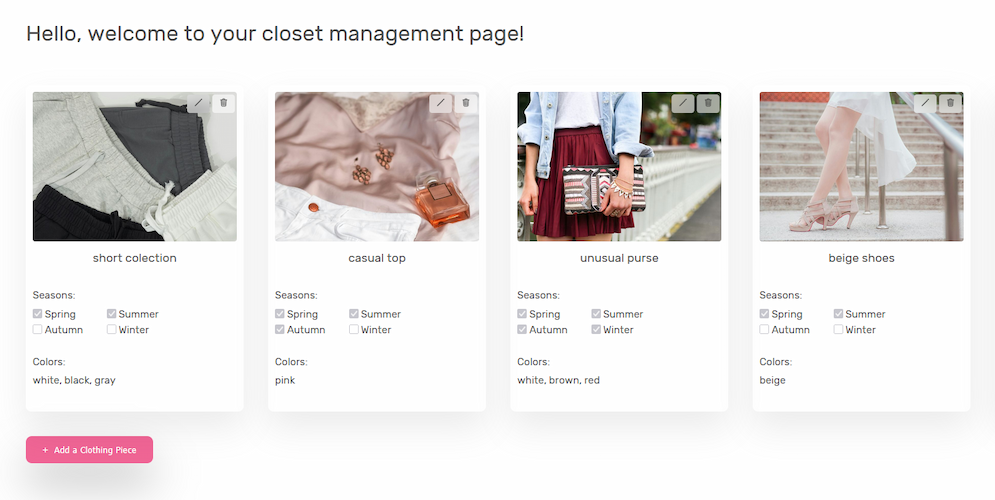

# The Closet App (Demo)


A full-stack web application for managing your wardrobe, built with **Vue.js**, **Node.js**, and **MongoDB**.  
It features user authentication with JWT, secure session handling with refresh tokens, and full CRUD functionality for managing clothing items.

## Table of Contents

1. [Frontend Demo](#1-frontend-demo)
2. [Features](#2-features)
3. [Tech Stack](#3-tech-stack)
4. [Project Structure](#4-project-structure)
5. [Project Setup](#5-project-setup)
6. [Usage](#6-usage)
7. [License](#7-license)
8. [Upcoming Improvements](#8-upcoming-improvements)
9. [Credits](#9-credits)

---

## 1. Frontend demo

If you are only interested in the overall style and UX/UI of the website, please proceed to [Live Demo (Frontend only)](https://theclosetportfolioproject.netlify.app/).

You can explore the following pages in this frontend demo without the need to sign up or download the whole project:

### 1.1 Public pages

- `/`
- `/login`
- `/signup`
- `/400`
- `/500`

### 1.2 Private pages

- `/closets`
- `/settings`

⚠️ Note: This demo shows the frontend only (no backend functionality).

---

## 2. Features

- Authenticate users with JWT
- Secure sessions with refresh tokens
- Hash passwords securely
- Perform CRUD operations on clothing items
- Integrate with MongoDB database
- Access protected API routes
- Responsive frontend built with Vue.js + Vite

---

## 3. Tech Stack

**Frontend:** Vue.js, Vite, CSS  
**Backend:** Node.js, Express, MongoDB, Mongoose  
**Authentication:** JWT  
**Testing:** Jest

---

## 4. Project Structure

```plaintext
the-closet-app-demo/
├── client/              # Vue frontend
│   ├── public/          # Static assets
│   └── src/             # Vue source code
│       ├── api/
│       ├── assets/
│       ├── components/
│       ├── composables/
│       ├── router/
│       ├── stores/
│       ├── views/
│       └── main.js
├── server/              # Express backend
│   ├── models/          # Mongoose schemas
│   ├── routes/          # Express routes
│   ├── controllers/     # Business logic
│   ├── utils/
│   ├── .env.example     # Environment variable template
│   └── app.js
├── assets/              # Project-level assets (e.g., screenshots)
├── README.md            # Project documentation
└── LICENSE              # MIT license


```

---

## 5. Project Setup

### 5.1. Clone the repository

```sh
git clone https://github.com/ferreira-ana/the-closet-app.git
cd the-closet-app-demo
```

### 5.2. Frontend

```sh
cd client
npm install
npm run dev
```

The frontend will be available at http://localhost:5173

### 5.3. Backend

1 - Copy the environment file template:

```sh
cd server
cp .env.example config.env
```

2- Open config.env and fill in your own values (database credentials and secrets).
For the database, you will need a MongoDB instance.
The format of the DATABASE and DATABASE_PASSWORD variables should be:

```env
DATABASE=mongodb+srv://<username>:<PASSWORD>@cluster0.mongodb.net/<dbname>?retryWrites=true&w=majority
DATABASE_PASSWORD=yourPassword
```

Replace <username> with your MongoDB username, <dbname> with your database name, and set DATABASE_PASSWORD to your actual password. The <PASSWORD> placeholder in the URI will be automatically replaced by DATABASE_PASSWORD.

3- Install dependencies and start the server:

```sh
npm install
npm run start
```

The backend will run on http://localhost:3000

### 5.3.1 Tests

To run the unit tests, run the following command in the server folder:

```sh
npm test
```

To look at coverage:

```sh
npm test -- --coverage
```

---

## 6. Usage

### 6.1 - User flow

1. **Sign up** for a new account using your email and password.
2. **Log in** to receive your personal JWT access token.
3. Once authenticated, you can:
   - Add clothing items to your virtual closet
   - Upload images and descriptions
   - Edit or delete existing items
4. Your session is managed securely with **access** and **refresh** tokens.

This app is designed to mimic a real user experience, including protected routes and form validation.

Example view from the dashboard:



### 6.2- Pages

The pages available for exploration are described on [Section 1](#1-frontend-demo) of this README.

---

## 7. License

This project is licensed under the MIT License.

---

## 8. Upcoming Improvements

The following features are currently being developed in a separate repository:

- Social authentication (Google, etc)
- Sending confirmation emails to users
- Outfit matching
- Decluttering section

---

## 9. Credits

Some of the images used in this project were sourced from [Unsplash](https://unsplash.com/) and are provided under their free-to-use license.
